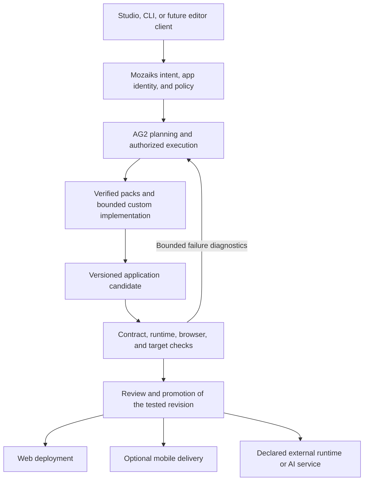

# ADR 0013: Multisurface Applications and Managed Delivery

Date: 2026-10-03

Status: Accepted for ownership and implementation sequencing on 2026-10-03.
Target-specific schemas and release gates remain pending; acceptance does not enable mobile, game, or model-training targets.

Source baseline: `BlocUnited-LLC/mozaiks` at `1a9431e06b08dca8adb846910b690a6d65e93179`.

## Decision

Extend Mozaiks through its existing application contracts, capability packs,
AG2 execution, and artifact lifecycle so that one application can support web,
mobile, interactive, and AI experiences. Keep portable mechanisms and a capable
self-hosted implementation in OSS. Offer managed delivery and operation through
`mozaiks-app`, consuming those same public mechanisms without a framework fork.

The initial mobile implementation should reuse the React web application through
an optional Capacitor delivery pack. Native renderers, authoritative multiplayer,
and model-training execution require separate, gated extensions. They must not
be advertised as existing capabilities or added as mandatory runtime dependencies.

This is a scoped delivery and extensibility proposal under the existing
[OSS software design](../architecture/MOZAIKS_OSS_SOFTWARE_DESIGN.md), not a second
north star. Acceptance of this ADR approves its ownership and sequencing;
each new schema or execution boundary still needs its complete implementation
contract, tests, and migration before enablement.

## Reason

The application lifecycle must accommodate more than forms and tables. A useful
framework should also support interactive communities, collaborative workspaces,
creative tools, games, and applications that call or adapt AI models. Mobile
distribution should not require customers to rebuild their backend or require
the hosted product to maintain private copies of generic framework code.

The constraint is maintenance. Mozaiks cannot sustainably own an agent framework,
mobile UI toolkit, game engine, messaging platform, model trainer, and cloud
scheduler. Its investment should be the application contract connecting those
systems, reusable verified components, and trustworthy change/release evidence.

### Intended user outcomes

1. Describe or import an application and receive inspectable source.
2. Choose supported delivery targets with explicit capability limitations.
3. Use a distinctive interface backed by real data and intentional permissions.
4. Request a change without losing unrelated behavior or saved data.
5. Inspect the exact version and test evidence before promoting it.
6. Operate locally or choose a managed operator through public interfaces.

The framework's commercial relevance depends on reducing failed builds,
integration work, maintenance effort, and release uncertainty. Adding a platform
name to a target menu is not evidence that these outcomes work.

## Authority and Related Decisions

- [ADR 0005](0005-reference-factory-and-proprietary-build-intelligence-boundary.md)
  governs the reference factory and private build intelligence. This proposal
  preserves its boundary; it does not reclassify existing OSS functionality.
- [ADR 0006](0006-provider-neutral-bounded-multi-workflow-journey-execution.md)
  governs journey execution, identity, and bounded work.
- [ADR 0007](0007-generalized-semantic-compiler.md) governs semantic authority
  and its staged cutover. Its acceptance is not proof of production cutover.
- [ADR 0010](0010-agent-and-app-sandbox-execution-boundary.md) separates agent
  execution from independent application acceptance.
- [ADR 0011](0011-factory-bounded-task-recovery.md) governs bounded Factory
  recovery and preservation of accepted work.
- [Issue #411](https://github.com/BlocUnited-LLC/mozaiks/issues/411) was reviewed.
  This proposal **adopts** typed application meaning, deterministic derivation,
  and traceable decisions; **defers** a new decision-ledger schema and any
  semantic-authority cutover; and **rejects** using a ledger, target manifest,
  app context graph, or provider response as a second application authority.
- [PR #734](https://github.com/BlocUnited-LLC/mozaiks/pull/734) proposes ADR 0012
  for compiled AppBuildPlan construction. It is a proposal, not a dependency
  already present in the baseline. This ADR neither accepts it nor changes its
  proposed treatment of revision/adoption availability.

At the inspected baseline, `AppBuildPlan` remains the production planning
boundary described by ADR 0007's cutover clarification. New delivery work must
consume the active owner. If semantic authority changes, delivery projections
move with that approved cutover; parallel old/new authoring paths are not kept.

## 1. Current Capability Baseline

"Implemented" below means source exists at the pinned revision. It does not
mean every provider, device, recovery scenario, or scale level passed live
acceptance. Historical incident logs and private application evidence are not
published by this proposal.

| Area | Source-backed status | Design consequence |
| --- | --- | --- |
| Application contracts and materialization | Implemented through Factory structured outputs, runtime loaders, and `AppGenerator/tools/assembly_phase.py` | Extend existing owners; do not introduce another app manifest or compiler. |
| Capability packs | Declared build contexts and templates exist; `community_component_lifecycle.py` also implements bounded local install and upgrade operations | Reuse packs. Remote discovery, trust, and hosted marketplace operations remain separate. |
| Web UI | Schema pages, registered custom React, semantic tokens, and immersive shell configuration exist | Rich interactions can use declared custom components. They need behavioral tests. |
| Mobile client foundation | `chat-ui` exports shared core/platform surfaces; runtime transport is documented in the mobile client contract | Shared state/transport is not a native renderer or signed mobile build pipeline. |
| Deployment targets | `materialize_app_config_contracts.py` emits `config/targets.json`; `deployment_contract.py` validates `container`, `compose`, and `external_adapter` delivery | Current target metadata does not implement iOS or Android compilation. |
| Refinement | AG2-backed classification, scope, structured coding, surface regeneration, and Factory re-entry exist | Consolidate lifecycle paths and make validation/recovery guarantees consistent. |
| External coding worker | Optional ACP provider exists; shipped policy disables it | Prove one provider in isolation before enabling broader use. |
| App preview | `SandboxPort`, Docker/E2B adapters, preview sessions, and persistence exist | Preserve artifact identity and independent acceptance across providers. |
| Durable work | Mongo queue, execution leases, replay, and reaction claims exist; the queue defaults to `noop`, with no production queue caller found in the inspected Python source | Connect and test the existing owners before claiming durable build execution. |
| Games | Custom/immersive web UI provides an integration point | No certified game pack, authoritative multiplayer service, or device performance guarantee is established here. |
| AI applications | AG2 workflows and provider configuration exist | Training jobs, model artifact promotion, and GPU operation require additional contracts and evidence. |

Baseline documentation drift must be corrected in the owning documentation:
the north star's local-component lifecycle description lags the install/upgrade
helpers now in source. The mobile client document also contains older wording
about a proprietary Refinement Engine; ADR 0005 keeps the generic mechanism and
capable reference refinement in OSS. Neither discrepancy authorizes a new
runtime owner or a private framework fork.

## 2. Architecture and Ownership

The diagram is the proposed lifecycle, not a claim that all target gates are
already connected. Delivery nodes are projections of the same application
revision; they are not additional authorities for application meaning.

| Owner | Responsibility | Must not acquire |
| --- | --- | --- |
| AG2 | Agents, model/tool calls, network turns, agent memory, middleware, execution events | Mozaiks app promotion or customer release authority |
| Factory | Approved plans, pack selection, deterministic assembly, typed task ownership and bounded repair policy | A second generic agent loop or a native/game/training engine |
| Refinement control plane | Baseline selection, scope, permitted route, artifact continuity | Untracked file writes or arbitrary model-selected promotion |
| Platform | App modules, routes, auth, data contracts, declared events and capability access | Hosted provider credentials or product billing policy |
| Studio | Build/review/preview interfaces, evidence, app management | Its own independent build state machine |
| App acceptance owner | Independent validation of the exact candidate and target | Treating an agent's self-report as passing evidence |
| Hosted operator | Managed workers, custody, delivery operations, quotas, billing and support | Private replacements for generic schemas, validators, or app semantics |
| App workspace | App-specific behavior, assets, brand, workflows, and declared integrations | Copies of shared Factory or private hosted platform internals |

### Execution boundaries

Use the existing AG2 structured worker for bounded planning and typed edits.
Evaluate the existing Claude Code ACP preset first because it is already the
configured optional adapter, not because comparative quality has been proven.
Keep provider selection replaceable. Add another provider only when the same
acceptance corpus demonstrates a useful quality, cost, availability, or latency
tradeoff. AG2 already drives external coding agents and receives their progress
through its ordinary execution API. [AG2 ACP client](https://docs.ag2.ai/docs/user-guide/acp/client/)

An external coding process runs in a verified isolation boundary with a frozen
baseline, explicit credentials, bounded resources, and controlled network
access. It may read approved context and propose changes to approved paths.
It cannot approve its own output, hold production signing keys, or mutate the
active application. ACP-mediated filesystem restrictions alone do not prove
operating-system isolation.

ADR 0010 remains authoritative: AG2 owns agent-side tools; `SandboxPort` owns
whole-app acceptance/preview. A mobile build executor or GPU job service may
require a new public port after an owner/API review. Do not force every workload
into `SandboxPort` or create a general Mozaiks subprocess framework.

## 3. Canonical Contracts and Extension Rules

### One app, multiple delivery artifacts

An app keeps one canonical identity, declared backend behavior, permissions,
data model, and artifact lineage. A web release and native package may share
that app revision while having different target-specific build evidence.

The existing build-task contract already declares file ownership, dependencies,
acceptance criteria, and domain context. `BuildRecord` carries lineage, input
versions, validation, and file manifests. Extend those owners when additional
artifact types are justified. Current refinement artifact creation supports
`app_bundle` only; native binaries and model checkpoints cannot simply be
relabeled as app bundles to bypass new type, storage, and promotion contracts.

Shared contracts do not imply identical screens or simultaneous releases.
Mobile clients can lag the backend. Every target must declare and test its
supported API/data compatibility window; a backend change cannot assume every
installed client updates immediately. Tenant, workspace, app, user, run, build,
and target identities remain distinct and server-validated.

### Public schema evolution

Extend existing target, deployment, pack, and artifact owners where they fit.
The following are required *design information*, not new accepted JSON/YAML
fields that generators may emit today:

| Information | Proposed placement/owner |
| --- | --- |
| Selected delivery targets and required capabilities | Existing app/target intent contracts, extended through strict models |
| Platform support, dependencies, templates, provenance | Versioned CapabilityPack descriptor and declared assets |
| Native permissions, link associations, plugin compatibility | Mobile pack's typed contract and validated materializer |
| Exact app revision, toolchain, pack and dependency identities | Existing artifact/build provenance, extended where necessary |
| Required checks and their exact executed results | Existing validation evidence and promotion policy |
| Signing/provider identity and credential references | Operator delivery records and secret backend; never app source secrets |

Before implementation, inventory current structured-output models, loaders,
renderers, validators, and generated paths. Pick one canonical field/name for
each concept. Update all producers and consumers together. Unknown targets,
capabilities, or combinations fail before execution. Do not add speculative
taxonomies for every possible future device or application genre.

All app-specific custom code must implement declared routes, components,
actions, workflows, or adapter boundaries. App code may be expressive; the
schema remains a small description of identity, composition, and obligations.
Untrusted pack discovery does not grant install, execution, or production
authority. Lock dependencies, retain provenance, inspect permissions, and
validate the exact installed pack version.

## 4. Mobile Delivery Design

### Recommended sequence

1. **Responsive web:** establish touch, keyboard, accessibility, navigation,
   safe-area and small-screen behavior.
2. **Optional PWA:** provide install metadata and a declared caching/offline
   policy using maintained tooling. Installation does not make server actions
   or AI inference available offline.
3. **Capacitor iOS/Android package:** package the validated web build and bridge
   only declared native capabilities. This reuses existing React DOM/CSS UI.
4. **Additional native renderer, if justified:** evaluate React Native/Expo
   when measured requirements cannot be met by the packaged web implementation.
   Reuse app contracts and portable client state, but implement native views.
   Flutter is deferred unless a concrete requirement justifies another renderer
   and toolchain.

Capacitor embeds web assets in a native container and exposes native plugins.
React Native uses native platform components; neither it nor Flutter
automatically converts existing browser components into native UI.
[Capacitor](https://capacitorjs.com/docs),
[React Native components](https://reactnative.dev/docs/intro-react-native-components),
[Flutter architecture](https://docs.flutter.dev/resources/architectural-overview)

The first public mobile pack should cover one bounded reference application,
with pinned tooling, native projects, local build instructions, and acceptance
fixtures. Mobile output layout and distribution packaging are new contracts to
be defined in that implementation; this document does not invent a currently
supported `clients/mobile` generator output path.

### Required device behavior

| Concern | Required behavior |
| --- | --- |
| Navigation | App routes, external links, back gestures, cold-start deep links, and invalid links have explicit outcomes. |
| Authentication | System-browser authorization with PKCE and validated return URLs; platform-appropriate token storage; no provider secrets in clients. |
| Permissions | Finite supported capability catalog; contextual requests; denial, revocation, and unavailable-device states are tested. |
| Offline | Begin with cached shell, explicit offline status, and recoverable drafts. Offline mutations require a separate conflict/idempotency contract. |
| Push | Bind device registrations to authenticated identity; reauthorize content when opened; handle logout and revoked tokens. |
| Lifecycle | Test background/foreground, process termination, token expiry, interrupted uploads, reconnect, and stale client versions. |
| Updates | Pin web/native plugin compatibility; initially release binaries through the stores. Backend/content updates remain separately controlled. |

Native capabilities belong to the trusted packaged application. External pages,
untrusted content, and generated-app previews must not inherit its privileged
native bridge. This applies especially when a mobile management app previews a
customer application. Choose an isolated browser/preview boundary and test that
preview content cannot invoke host plugins or read host credentials.
[Google WebView security guidance](https://support.google.com/googleplay/android-developer/answer/10768383)

Do not build a custom authentication, synchronization, storage, or notification
engine inside the mobile pack. Use maintained platform tooling behind the
smallest suitable public adapter. Native OAuth has browser and redirect
requirements beyond rendering the existing login page in a WebView.
[Native OAuth](https://www.rfc-editor.org/info/rfc8252/),
[Google OAuth policy](https://developers.google.com/identity/protocols/oauth2/policies)

### Mobile acceptance and release

Playwright verifies shared browser behavior; it does not establish native
permissions, installed-app lifecycle, push delivery, or signed-binary behavior.
Require emulator/simulator tests and physical-device evidence for the supported
release matrix. Pick a maintained native automation tool after a reference
package exists; do not create a mobile test runner.

iOS release builds require a compatible macOS/Xcode environment and signing
setup. An ordinary Windows or Linux preview does not satisfy that gate. Android
requires its supported SDK/build toolchain and signing workflow. Missing build
hardware/accounts are explicit prerequisites, not skipped passing checks. No
paid build infrastructure is provisioned by this design.
[Capacitor environment](https://capacitorjs.com/docs/getting-started/environment-setup),
[Android app signing](https://developer.android.com/studio/publish/app-signing)

Packaging is not store approval. Apple guideline 4.2 requires sufficient app
utility, and 4.2.6 places submission responsibility for app-generation-service
outputs with the content provider. Design for customer-owned developer accounts
and customer submission authority, with managed preparation and assistance.
Recheck applicable store rules for every release program; do not promise blanket
publication under Mozaiks' account.
[Apple review guidelines](https://developer.apple.com/app-store/review/guidelines/)

Do not initially offer unrestricted downloaded-code updates or assume web
checkout satisfies mobile digital-purchase rules. Any update service or mobile
purchase capability needs platform-specific policy review, integrity and
compatibility checks, and tested recovery.
[Google update policy](https://support.google.com/googleplay/android-developer/answer/16559646),
[Google payments policy](https://support.google.com/googleplay/android-developer/answer/10281818)

### Mobile as a premium service

The OSS pack and public delivery contract enable a competent self-hoster to
build with their own tools/accounts. A paid hosted service may supply build
capacity, signed artifact preparation, device testing, credential custody,
release tracking, retention, and support. It sells operation of the capability.

Signing credentials remain in the operator's secret system, scoped to the
customer and release. Untrusted dependency installation and generated build
scripts cannot access signing/store credentials or authorize a release.
A separate controlled signing/export step consumes the approved artifact and
verified customer/release binding, with narrowly scoped access and an audit trail.
Record both input and signed-output digests and verify the installed release artifact.
Private keys, store tokens, private customer datasets, and operator account
topology never enter public templates or generated app artifacts. Secrets also
stay out of model context. Customer-owned content and brand assets intentionally
selected for publication may be included under their applicable rights.

## 5. Rich Applications and Games

### UI composition

Support schema-native pages for stable compositions, semantic-token React for
reusable custom experiences, and registered app-specific React for experiences
that require it. Do not expand page YAML into a game or drawing language.
Separate gameplay/canvas/editor state from persistent business state and from
agent conversation state.

An application can have an immersive game/editor route alongside conventional
account, settings, community, and administration routes. App-specific branding
belongs to the app, including its business administration. Workspace/build
management remains a separate Mozaiks destination. Access to a generated app
does not grant access to its builder or to other apps.

### First game capability

Develop an optional browser 2D game pack around a maintained engine such as
Phaser, using its scene, input, animation, and rendering APIs. Pin the chosen
engine version and expose a bounded game entrypoint through the existing custom
route contract. Keep auth, profiles, saves, and authorized score submission in
ordinary app modules. The engine is an optional pack dependency, not a mandatory
dependency of every app. [Phaser](https://docs.phaser.io/phaser/getting-started/what-is-phaser)

The first acceptance game should be small but genuinely playable: start,
controls, score, loss/win, restart, pause/resume, and responsive layout. Define a
reference device, frame-time budget, memory budget, and input-latency budget
before implementation. Visual snapshots are supplemental evidence.

Client scores cannot become trusted competitive rankings merely because they
arrive through an authenticated request. Competitive or economic consequences
require server validation or an authoritative simulation.

### Multiplayer and demanding graphics

AG2 conversations and workflow WebSockets do not provide a real-time game
server. High-frequency simulation belongs in a maintained game/network engine
or explicitly integrated external service. The simulation must not wait for
LLM responses or send per-frame updates through generic module action dispatch.

Authoritative multiplayer requires a later decision covering room ownership,
latency, synchronization, matchmaking, reconnect, anti-cheat, rate limits,
and load evidence. Evaluate established implementations against one concrete
game before choosing a dependency. For demanding 3D/native workloads, evaluate
a dedicated engine target such as Godot rather than assuming the web shell
can meet the requirement. Neither target is promised by this ADR.
[Godot multiplayer](https://docs.godotengine.org/en/stable/tutorials/networking/high_level_multiplayer.html),
[Godot dedicated servers](https://docs.godotengine.org/en/stable/tutorials/export/exporting_for_dedicated_servers.html)

Agents may generate quests, dialogue, levels, or asynchronous content behind
bounded schemas and validation. Gameplay must handle unavailable or rejected
AI output with tested fallback behavior. Persist accepted content revisions;
do not place probabilistic output in timing-critical authoritative rules.

## 6. AI Experiences and Model Workloads

"An AI app," "adapting a model," and "training a new foundation model" are
different products and require different evidence.

| Workload | Framework direction | Additional requirements |
| --- | --- | --- |
| AI feature or agent workflow | Existing AG2 execution with declared tools and app actions | Authorization, budgets, structured outputs, quality evaluation and user-visible failure handling |
| Retrieval over app/customer data | Authorized app-data retrieval integrations and AG2 KnowledgeStore where appropriate | Data access policy, indexing provenance, deletion and retrieval quality; build/refinement AppContext remains separate |
| Fine-tune or adapter training | Future optional pack calling a maintained trainer/job provider | Approved dataset, base-model compatibility, job lifecycle, compute quota, evaluation, artifact lineage |
| Model serving | Declared integration to a supported inference service | Authentication, capacity, latency, version routing, rollback and usage accounting |
| New foundation-model research | Explicit external research/HPC project integration | Substantial data, compute, distributed training, research and operating expertise |

Mozaiks should be able to build the application around a model workflow and
coordinate declared jobs. It should not implement autodifferentiation,
distributed training, or inference serving kernels. For a future adaptation
reference pack, evaluate maintained tools such as PEFT/TRL; use their native
adaptation/trainer APIs and supported checkpoint/resume hooks, coordinated
through the explicit job/provider lifecycle. Do not build a Mozaiks training
framework or treat PEFT itself as a durable job controller.
[PEFT](https://huggingface.co/docs/peft/index),
[TRL SFTTrainer](https://huggingface.co/docs/trl/sft_trainer)

A training request must identify the approved dataset revision, usage rights,
base-model identity/license, training configuration, compute budget and stop
conditions. Result evidence must identify the exact weights/adapter, tokenizer,
code and environment, evaluation dataset, metrics and limitations. These are
proposed artifact obligations, not an implemented model registry schema.

Long-running GPU work belongs behind an explicit job/provider boundary. App
modules own durable user-facing job facts; a provider adapter owns mechanics.
Do not leave an HTTP request open for training or turn a workflow chat into the
only job record. Cancellation and uncertain provider outcomes require durable
reconciliation. No GPU service is provisioned until a separately authorized
workload and budget exist.

Model promotion and app promotion are distinct. A tested app can reference a
previously approved model version; a newly trained model must pass its own
evaluation and compatibility gates before changing production routing.
Customer data, private weights, evaluation corpora, and usage evidence are not
automatically public or eligible for cross-customer training.

## 7. Determinism, Validation, and Quality

### Guarantees must be stated precisely

| Property | What Mozaiks can require | What it must not claim |
| --- | --- | --- |
| Contract determinism | A valid reference resolves to one declared runtime concept; invalid references reject | Every valid schema expresses correct product behavior |
| Materialization reproducibility | Pinned accepted inputs produce the expected canonical source artifacts | Identical prompts always produce identical plans |
| Build provenance | Record source/dependency/toolchain identities and artifact digests | Every signed binary is byte-identical across machines |
| Runtime correctness | Tested invariants and user journeys hold for the supported matrix | Tests prove the absence of all defects |
| AI/training repeatability | Record model/data/configuration and measure repeated outcomes | Seeds alone guarantee identical provider or GPU results |
| Game behavior | Validate explicit simulation/input rules and reference performance | Arbitrary physics/rendering is identical on all devices |

Even identical training seeds do not guarantee reproducibility across framework
releases, platforms, or CPU/GPU execution. Record the tested environment and
declared tolerances. [PyTorch reproducibility](https://docs.pytorch.org/docs/stable/notes/randomness.html)

The source relationship graph supports impact analysis and reference closure.
It is derived app context, not behavioral proof. Agents propose candidates;
independent deterministic code validates and promotes. Semantic evaluations
and design review add quality evidence but cannot override failed correctness,
security, or compatibility checks.

### One evidence path through the actual user journey

Preserve the existing artifact lifecycle while consolidating old promotion and
validation implementations. Draft saving, validation, user acceptance,
promotion, deployment, and store approval remain distinguishable operations.
The labels in this paragraph are lifecycle meanings, not new enum values.

Required evidence for a release candidate:

1. **Structure:** schema/reference closure, declared bindings, dependency and
   pack integrity, and absence of placeholder implementations.
2. **Build:** applicable compilation, static analysis and tests for the actual
   target with recorded toolchain and results.
3. **Runtime:** boot the exact bundle with realistic disposable persistence;
   exercise actual actions, migrations and negative permission cases.
4. **Interaction:** real browser journeys against the backend; native device
   journeys when the target is mobile; game input/state tests for game packs.
5. **Lifecycle:** human reply, reconnect, cancellation, interrupted execution,
   replay, staged review and promotion through the normal entrypoint.
6. **Identity:** bind evidence to app revision, candidate digest, source,
   dependencies, provider/session and test revision. Rechecking a different
   artifact does not authorize this one.

A required skipped or unavailable check blocks that target's release readiness.
Optional checks are explicitly classified before execution; failed required
checks cannot be reclassified afterward to make a candidate pass. Drafts may
remain inspectable while blocked. Repaired artifacts require fresh affected
checks and preservation of unrelated accepted behavior.

Define expected product behavior before asking an agent to implement it. Use
maintained pack regression fixtures and independently specified acceptance
scenarios. Tests generated from the same mistaken implementation are not
sufficient independent evidence. Record accessible design review, useful
loading/error states, and interaction quality alongside technical checks.

### Bounded repair

Extend existing AG2 execution and Factory recovery principles to missing
refinement paths. Supply exact validation diagnostics, retain file/contract
ownership, preserve successful unrelated work, and cap attempts, time and
spend. Stop on repeated failure fingerprints, no progress, unknown ownership,
or uncertain side effects. Do not add a separate generic planning/retry engine.

The external coding worker's ability to run tests is useful during implementation;
final acceptance still executes through Mozaiks' independent evidence path.

## 8. Scale and Operational Reliability

Separate build workloads from running customer applications. An ordinary page
request or deterministic app action should not require an LLM call. Slow
generation, native compilation, and training jobs must not consume the request
handling capacity needed by already deployed apps.

Evaluate the existing queue, execution leases, replay and artifact stores as
the initial integration points. The inspected workflow queue defaults to the
non-durable `noop` backend, and no production caller of `get_workflow_queue`
or `MongoWorkflowQueue` was found outside its module in the inspected Python
source. Configuration alone does not connect it. Trace admission through the
active execution owner, connect or consolidate the existing primitive, and
prove durable processing before claiming multi-worker recovery.

Required operational behavior:

- Bounded global and per-tenant admission, with visible queued state and
  cancellation. Extend the current admission owner; do not create an agent scheduler.
- Durable run identity, leased worker ownership, fencing of stale completions,
  and retry/dead-letter policy appropriate to the operation.
- Idempotency keys for repeatable requests and externally visible effects.
  At-least-once delivery is not exactly-once side-effect execution.
- Completed results persisted before delivery acknowledgement; reconnect
  recovers the result without rerunning completed generation.
- Explicit handling of interrupted non-idempotent effects. An uncertain
  external write blocks automatic retry until reconciled.
- Per-run time/token/compute/storage budgets, clean termination, attributable
  sandboxes and confirmed cleanup.
- Tenant-scoped credentials, data, caches, artifacts and retrieval. Correlation
  IDs are evidence, not authorization.
- Metrics for completion rate, queue wait, end-to-end latency, repair count,
  cost per accepted change, resource use and escaped defects.

Sutando demonstrates dispatch to an established coding worker. Agent-connect
demonstrates retained results and recovery-aware delivery. Apply those useful
behaviors through existing Mozaiks owners rather than importing another task
directory, session journal, Matrix room model, or relay scheduler.
[Sutando dispatcher](https://github.com/sonichi/sutando/blob/5e5e87dd1b7a81d68930933291a89634b731b91c/src/task-dispatcher.ps1),
[agent-connect journal](https://github.com/ag2-space/agent-connect/blob/c6e2d0519d6c8038e6597bf888afb1993343b368/relay-client/ag2_relay_client/journal.py)

Validate restart, duplicate delivery, worker loss, stale leases, provider
timeouts and noisy-neighbor behavior at declared concurrency. Set numeric
service objectives from measured reference workloads before a hosted launch.
Do not substitute an architecture diagram for load results or add paid
infrastructure as a pre-launch prerequisite without operator authorization.

## 9. OSS Boundary and Paid Product

### Capability versus operation

| Capability | OSS/self-host baseline | Hosted product may charge for |
| --- | --- | --- |
| Build and refine | Canonical contracts, capable Factory, AG2 adapters, local operation and evidence | Managed execution, team workflows, reserved capacity and support |
| Mobile | Public pack/contracts, source project generation, local instructions and checks | Build/signing assistance, device testing, artifact retention and release operations |
| Game experiences | Generic integration contracts, selected reference pack and validation | Managed game service operation or separately licensed specialist services |
| AI workflows | Agent/tool contracts, provider configuration, local baseline | Managed model access, capacity, operational support and declared hosted capabilities |
| Model adaptation | Public job/artifact interfaces and a viable local/reference integration when introduced | Managed compute, serving, retention and operational support |
| Component ecosystem | Pack formats, provenance, local install/upgrade and validation | Hosted discovery, commercial distribution and operator services |
| Intelligence | One-app source/context analysis and capable reference strategy | Reviewed private optimization and legitimately collected cross-app operational intelligence |

These are proposed product categories, not prices, promised margins, or an
implementation of every service. Mobile build/device/signing work has real
operating costs; measure them before offering unlimited usage or setting plans.
The generic mobile mechanism must not be usable only through a hidden hosted
endpoint. A third-party operator may implement the same public service contract.

Customer application facts, declared contracts and accepted source remain
portable. Export terms must disclose actual dependency/model/asset licenses;
do not assume every generated dependency or weight is MIT merely because
Mozaiks is. Existing public material is not made private retroactively.

### Private-by-default material

Keep operator-specific hosted provider executors, signing/account topology, commercial
policy, customer-derived datasets, learned routing, optimized operating
playbooks, private evaluations and fleet-level outcome intelligence in the
operator repository or approved private stores. Public generic interfaces may
describe required behavior without embedding those implementations or data.

Privacy is part of this boundary. Customer source, prompts, interaction logs
and trained models are not automatically pooled across tenants. Any permitted
learning program needs explicit data-use terms, access controls, retention,
deletion, provenance and appropriate aggregation. Being commercially useful
does not create permission to reuse customer data.

Public reference fixtures must be synthetic or intentionally licensed for
publication. Detailed evidence from private `mozaiks-app` traversals remains
private unless separately reviewed. This ADR contains generic design principles
and public source observations, not private operational weights or datasets.

## 10. Dogfooding Without a Fork

1. `mozaiks-app` pins an exact public OSS revision/release and consumes public
   host, platform-extension, workflow-overlay and capability seams.
2. Generic missing behavior is implemented once in OSS with a reference test.
   Hosted-only mechanics remain behind an app-owned facade/provider adapter.
3. Do not copy Factory workflows, change public validators privately, monkeypatch
   core behavior, or maintain hosted-only application schemas.
4. The hosted workspace may select private strategy through declared context,
   workflow overlays, middleware or supported policy injection. Those choices
   must produce the same canonical app and pass the same public correctness gates.
5. A mobile version of `mozaiks-app` uses the same delivery pack as another
   customer app. Its entitlement to a managed builder does not grant exemptions
   from target compatibility, permissions, signing, or validation.
6. Acceptance records pin both OSS and hosted-app revisions, dependencies and
   candidate artifacts. A passing test on a different pair cannot authorize release.

A packaged mobile management app does not automatically become a container for
downloading and running arbitrary generated apps with native privileges. Such
a product needs a separate execution, security, and store-policy decision,
including applicable mini-app rules. Start with management and isolated previews.
[Apple mini-app guidelines](https://developer.apple.com/app-store/review/guidelines/#mini-apps-mini-games-streaming-games-chatbots-plug-ins-and-game-emulators)

Use the distinction between app usage and platform management in the UX:
customer apps open into their own brand; their business admin remains app-scoped.
Authorized creators can return to Mozaiks workspace/build management. Dogfooding
can show the same brand at both levels, but context labels and permissions must
make the current app/workspace clear. Do not embed a second builder in each app.

A future VS Code client should call these same public build/review services.
It must not create a competing local run, artifact, or promotion implementation.

## 11. Implementation Plan and Release Gates

Milestone labels below are planning identifiers, not new runtime taxonomies.
Work is ordered by evidence dependencies rather than promised calendar dates.

| Milestone | Concrete deliverable | Exit gate |
| --- | --- | --- |
| M0 — truthful lifecycle | Correct failed-result reporting; resolve normal-path continuation blockers; inventory duplicate promotion/validation paths and inactive settings | Failed, cancelled and unverified work cannot claim release readiness; user replies resume the actual journey |
| M1 — complete web journeys | Public synthetic community app plus a private bounded App Zero refinement through Studio | Real backend/database/browser interactions, two-user negative tests, preserved data and exact-artifact promotion |
| M2 — coding and recovery | Bounded diagnostic-driven repair through the default structured provider with ACP disabled; separately qualify one isolated ACP provider | Both paths prove truthful results, scope containment, real edits, independent checks, interrupted delivery and cleanup; ACP also proves progress/cancel/reconnect |
| M3 — mobile pack | Public PWA/Capacitor contract, materializer, supported plugin matrix and local reference projects | Android and iOS supported-device evidence; signing/source provenance; unknown capabilities rejected |
| M4 — managed mobile dogfood | Hosted build/signing preparation behind public contracts; `mozaiks-app` and a synthetic customer app both consume it | Exact OSS/app pair, customer account isolation, artifact recovery, app-specific branding and install/update checks |
| M5 — richer packs | Playable 2D game and a bounded AI workflow pack; later optional model-adaptation reference | Game state/performance tests; AI authorization/budget/evaluation; training evidence before any model promotion |
| M6 — scale qualification | Concurrent build/app operation with durable configuration and failure injection | Published supported envelope and measured service objectives; no cross-tenant effects or duplicate promotion |

M2 and mobile design research may proceed alongside M1, but no target is labeled
release-ready before its own gates pass. Existing working web/self-host paths
must remain usable during additive delivery work. Any plan-authority migration
that intentionally changes mode availability needs its own accepted cutover
decision; this roadmap does not silently authorize that change.

### Required acceptance matrix

| Reference scenario | Minimum proof |
| --- | --- |
| Community web app | Create/comment/react/delete; reload/restart persistence; author-only mutation; responsive loading/error/empty states |
| Business app | Role-aware actions and one nontrivial workflow; denied access; concurrent edits with explicit conflict behavior |
| Brownfield refinement | Complete discovery with repeated human replies; representative frontend/backend/test coverage; bounded edit; preservation checks; review and promotion |
| Mobile reference | Shared business actions plus cold-start links, browser OAuth return, permissions, background/foreground, offline messaging and installed update |
| Mobile dogfood | Same pack/public interfaces; separate app/tenant credentials and branding; exact dependency-pair evidence |
| 2D game | Start/input/score/end/restart, pause/resume, target-device performance and rejected untrusted score claims |
| AI workflow | Structured output, tool authorization, provider timeout, usage limit, cancellation and unavailable-model behavior |
| Model adaptation, when introduced | Dataset/model provenance, bounded job, checkpoint recovery, independent evaluation, denied unapproved serving promotion |
| Recovery/load | Disconnect, duplicate request, worker death, stale completion, sandbox deadline and persisted-result redelivery |

Run deterministic reference fixtures continuously. Use live provider/device
acceptance on the exact candidate pair before enabling the corresponding
capability. A mocked UI test remains useful for rendering but does not replace
behavioral acceptance against actual services.

### First implementation slice

The first slice corrects `OrchestrationControlHarness.execute_coding_request`:
on the source baseline, a worker returning failed validation reached a completion
event with `outcome="ok"`.
Make events, refinement session status and promotion eligibility consistent,
including skipped/pending checks, through the existing Studio entrypoint.
Then repair the normal discovery/reply/reconnect journey before expanding the
set of advertised targets.

Consolidate BuildRecord creation/acceptance and the standalone versus Studio
validation paths in bounded follow-up changes. Preserve useful validators;
remove obsolete internal branches, duplicated schema names and unused settings
after consumer inventory. Do not start by replacing the entire refinement engine.

## 12. Migration, Enablement, and Rollback

Before each new target or pack becomes available:

1. Record the current owner and the maintained upstream primitive to be used.
2. Define the smallest strict contract, including unsupported combinations.
3. Update plan outputs, prompts, declared assets, materialization, runtime
   loading, validation, examples and tests in the same coordinated change.
4. Keep the capability unavailable until its reference app and target tests pass.
5. Dogfood through public OSS interfaces with exact revision evidence.
6. Admit hosted operation only after secrets, tenancy, quotas and recovery pass.

Rollback should disable new target admission and restore the previous accepted
release. Preserve source/artifacts and failure evidence. Backend/data migrations
need their own compatibility and recovery plan; reverting a frontend binary
does not reverse a destructive database change. Installed mobile versions
continue to exist after a new release, so server compatibility is a release gate.

No automatic remote pack installation, broad code download service, paid
infrastructure provisioning, PyPI publication, or store submission is authorized
by creating this proposal.

## Alternatives Considered

| Alternative | Decision and reason |
| --- | --- |
| Rebuild Studio and every app in Flutter now | Deferred: introduces another renderer/toolchain before a mobile workload demonstrates the need. |
| Make all mobile contracts proprietary | Rejected: prevents independent self-hosting and encourages a private app model. Managed operation can be paid. |
| Package every website and promise store approval | Rejected: native behavior, policy and device acceptance remain obligations. |
| Adopt Sutando or agent-connect as the execution backbone | Rejected: the useful coding integration already exists through AG2; additional task/session infrastructure would overlap current owners. |
| Use Matrix for all app/workflow state | Rejected: messaging rooms and synchronization are not the canonical app artifact or execution authority. Revisit only for a concrete messaging product requirement. |
| Generate every application from scratch | Rejected: verified packs and deterministic assembly reduce repeated work and contract drift. |
| Force every experience into page YAML | Rejected: rich custom behavior belongs behind declared code/engine integration points. |
| Build a Mozaiks game engine or model trainer | Rejected: integrate maintained engines/trainers and own their application boundaries. |
| Treat graph closure or an LLM review as proof of correctness | Rejected: actual runtime, user interaction and target evidence remain required. |

## Consequences

The same application contracts can support more experiences without multiplying
framework implementations. OSS contributors and hosted operators improve the
same foundation. Pack/version provenance and acceptance become reusable assets.

The maintenance commitment is still substantial and explicit: Mozaiks owns its
schemas, pack integrations, materializers, validators, lifecycle adapters,
reference apps, target compatibility matrices and upgrades. The hosted operator
owns managed workers, custody, account integration, operational support and
commercial policy. Upstream projects own their agent, rendering, game, training,
and device primitives; their updates still require compatibility testing.

Additional targets increase testing cost. Native distribution introduces store
and hardware dependencies. Custom code widens the behavioral test surface.
These costs require measured product demand and gated rollout.

## Reversibility

**High risk for published contracts; medium risk for implementation choices.**
Public schema adoption and publication are difficult to reverse. Keep the
initial target/pack contract small. Capacitor or a coding provider can later be
replaced behind an accepted interface, but existing app source, installed
clients, provenance and migration obligations still need support. This proposal
does not change the repository license or retract public functionality.

## Affected Invariants

All eight [architectural invariants](https://github.com/BlocUnited-LLC/mozaiks/blob/1a9431e06b08dca8adb846910b690a6d65e93179/ARCHITECTURAL_INVARIANTS.md) apply:
provider neutrality, names-only secrets, deterministic validation/promotion,
versioned public contracts, reviewed learned intelligence, bounded authority,
public-contract dogfooding, and explicit operator separation. No exemption is
proposed for mobile, game, AI, or first-party applications.

## OSS Boundary

**Keep OSS: foundational mechanisms and capable reference paths. Open interface,
reviewed operator implementation.** The public proposal is based on existing
public contracts and cited upstream capabilities. New provider execution,
optimized strategy, datasets and commercial operating details require the
publication review prescribed by ADR 0005 before entering public source.

## Validation

For this documentation change: verify local links/source anchors, ADR structure,
architecture/OSS consistency, documentation build, source hygiene and an
independent design review. No new implementation or live acceptance is claimed.

For implementation: use the milestone gates and acceptance matrix above, with
the exact supported source/artifact/toolchain identities. Existing unit tests
do not establish native-device, external coding-agent, game-performance,
training, or concurrent production readiness.

### Questions to resolve in implementation design

These require source-backed implementation decisions, not a nontechnical owner
choosing frameworks in advance:

- Exact target contract and app-workspace output placement after producer/loader inventory.
- Supported initial device/OS/plugin matrix and measured performance thresholds.
- Native test tooling after the first local package can be installed.
- Isolation mechanism for the chosen ACP bridge and its permitted tools/network.
- Model-job and multiplayer provider selection only after a concrete reference workload.
- Hosted operating costs, support envelope and service objectives before pricing/launch.

## Source Map

Primary repository owners inspected at the pinned baseline:

- `factory_app/workflows/AppGenerator/structured_outputs.yaml`
- `factory_app/workflows/AppGenerator/tools/assembly_phase.py`
- `factory_app/workflows/AppGenerator/tools/materialize_app_config_contracts.py`
- `factory_app/workflows/AppGenerator/tools/deployment_contract.py`
- `factory_app/workflows/AppGenerator/tools/community_component_lifecycle.py`
- `factory_app/workflows/AppGenerator/tools/app_validation.py`
- `factory_app/workflows/AppGenerator/tools/app_runtime_smoke.py`
- `factory_app/workflows/AppGenerator/tools/repair_policy.py`
- `mozaiksai/control_plane/implementations/orchestration_control.py`
- `mozaiksai/control_plane/implementations/coding_worker.py`
- `mozaiksai/control_plane/implementations/coding_provider_selection.py`
- `mozaiksai/control_plane/implementations/acp_coding_provider.py`
- `mozaiksai/control_plane/artifact_promotion.py`
- `mozaiksai/control_plane/app_validation.py`
- `mozaiksai/core/ports/app_backend.py`
- `mozaiksai/core/ports/sandbox.py`
- `mozaiksai/core/artifacts/models.py`
- `mozaiksai/core/sandbox/preview_sessions.py`
- `mozaiksai/core/workflow/queue.py`
- `mozaiksai/core/runtime/persistence/distributed_lock.py`
- `mozaiksai/core/transport/run_replay.py`
- `mozaiksai/core/runtime/composition/reaction_idempotency_store.py`
- `chat-ui/package.json`
- `chat-ui/src/config/validateConfig.js`

External documentation was reviewed on 2026-10-03. Recheck toolchain and store
requirements when implementing and releasing; provider documentation changes
independently of this ADR.
