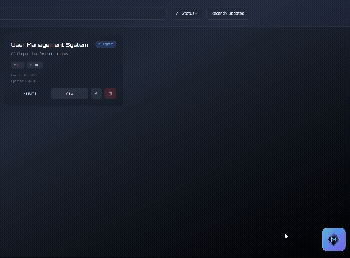

# Setting Up mozaiksai

Follow the steps below to either run the canonical Mozaiks hosts in this repo
or embed the runtime substrate into another backend.

---

## 1. Install Required Packages

To begin, install the required backend and frontend packages:

```bash
# Backend - AI workflow runtime
pip install mozaiksai

# Frontend - Chat widget components
npm install @mozaiks/chat-ui
```

| Package | What it provides |
|---------|------------------|
| `mozaiksai` | Workflow execution, WebSocket streaming, persistence, token tracking |
| `@mozaiks/chat-ui` | `ChatWidget` component, chat interface, artifact rendering |

---

## 2. Integration Points

There are two valid integration modes.

### Step 2.1 --- Use the canonical repo hosts

If you are running this repo directly, the canonical entrypoints are the root
host files:

```bash
# Defaults to the local/private Studio host
mozaiks serve .

# Or target a specific layer directly
python run_runtime.py
python run_platform.py
python run_studio.py
python run_mozaiks.py
```

Use this mode when you want the layered repo architecture as-is.

### Step 2.2 --- Embed the runtime substrate into another backend

If you are integrating `mozaiksai` into an external backend, mount the
runtime-only convenience factory explicitly:

```python
# your-app/backend/main.py
import os
from fastapi import FastAPI
from mozaiksai import create_mozaiks_app

app = FastAPI()

# Canonical shared generation-core path for this repo layout
os.environ["MOZAIKS_WORKFLOWS_PATH"] = "./factory_app/workflows"

@app.get("/api/users")
def get_users():
    ...

app.mount("/ai", create_mozaiks_app(workflow_dir="./factory_app/workflows"))
```

This `/ai` mount pattern is for external embedding mode only. In the canonical
repo hosts above, `mozaiksai` is already composed into the selected root host.

### Step 2.3 --- Add the Chat Widget to Your Frontend

Open your frontend entry file (e.g., `App.jsx`). Add the ChatWidget as a floating overlay:

```jsx
// your-app/frontend/src/App.jsx
import { ChatWidget } from '@mozaiks/chat-ui';

function App() {
  // Auth is YOUR responsibility - use whatever system you have
  const { user } = useYourAuthSystem();

  return (
    <>
      <YourRouter />

      {/* Floating chat button - expands on click */}
      <ChatWidget
        endpoint="ws://localhost:8000/ai"
        userId={user?.id || 'anonymous'}
      />
    </>
  );
}
```

Use the `/ai` endpoint only when you mounted the runtime that way. If you are
running the canonical repo hosts directly, point the widget at that host's base
URL instead of assuming an `/ai` prefix.

Or embed a specific workflow directly using `WorkflowChat`:

```jsx
import { WorkflowChat } from '@mozaiks/chat-ui';

function SupportPage() {
  const { user } = useYourAuthSystem();

  return (
    <div className="h-screen">
      <WorkflowChat
        workflow="CustomerSupport"
        userId={user.id}
        onClose={() => navigate('/')}
      />
    </div>
  );
}
```

The ChatWidget is a floating button that expands to a chat overlay:

<div align="center">



*Click the button to expand/collapse the chat interface*

</div>

---

## 3. Workflow Directory Structure

You will need a place for first-party factory workflows to live. In this repo they
live under `factory_app/workflows/`. App-owned workflows live under the
active app root's `app/workflows/`. Below is the canonical factory workspace
structure:

```
factory_app/
└── app/
  └── workflows/
    ├── extended_orchestration/
    │   └── extension_registry.json   # Cross-workflow pack registry (optional)
    └── {workflow_name}/
      ├── extended_orchestration/
      │   └── mfj_extension.json    # Per-workflow MFJ config (optional)
      ├── orchestrator.yaml
      ├── agents.yaml
      ├── handoffs.yaml
        ├── context_variables.yaml
        ├── structured_outputs.yaml
        ├── tools.yaml
        ├── ui_config.yaml
        ├── hooks.yaml
        ├── tools/
        │   └── *.py
        └── ui/
            ├── index.js
            └── *.{js,jsx}
```

Workflow declaratives are strict YAML contracts.

Minimal `context_variables.yaml`:

```yaml
definitions: {}
agents:
  GreeterAgent:
    variables: []
```

---

## 4. Chat Modes

mozaiksai supports two chat modes:

### Ask Mode

A general-purpose agent that lets users ask questions about your app or product. Think of it as a conversational assistant that knows about the user and your domain.

- Users can ask freeform questions
- Configured via a system prompt (`ask_mode_prompt` in ai.json)
- Future: will support context variables for dynamic knowledge injection

### Workflow Mode

Purpose-built multi-agent workflows for specific tasks. These are the workflows
you create in the active app root, such as `app/workflows/` in the canonical
workspace model. App Zero keeps local journey and launcher config under
`mozaiks-platform/app/workflows/extended_orchestration/extension_registry.json`, but its shared build
workflow implementations also resolve from `factory_app/workflows/`.

- Follows a defined agent orchestration pattern
- Has specific tools, handoffs, and structured outputs
- Best for guided, multi-step processes

### See It In Action

<div align="center">

| Workflow Mode | Ask Mode |
|:---:|:---:|
|  |  |
| *Chat + Artifact split view* | *Full chat with history sidebar* |

</div>

---

## 5. Trigger Configuration

The `ai.json` file controls which mode the ChatWidget opens in:

```json
// app/config/ai.json
{
  "ask": {
    "ask_mode_prompt": "You are a helpful assistant for our product. Answer questions about features, pricing, and usage.",
    "ask_context_variables": null
  },
  "chat": {
    "chat_startup_mode": "ask"
  },
  "workflows": {
    "entry_point": "CustomerSupport"
  }
}
```

| `chat_startup_mode` | Behavior |
|---------------------|----------|
| `"ask"` | Widget opens in Ask mode (general chat). User can switch to workflows. |
| `"workflow"` | Widget opens directly into the `entry_point` workflow. |

**Changing modes requires no code changes** - just edit `ai.json`.

---

## 6. Theming & Branding

Customize the chat appearance to match your brand.

### CSS Variables

Colors and fonts are controlled via CSS variables. Add these to your global CSS:

```css
:root {
  /* Primary brand color - buttons, user messages, accents */
  --mozaiks-primary: #6366f1;
  --mozaiks-primary-hover: #4f46e5;

  /* Background colors */
  --mozaiks-bg: #ffffff;
  --mozaiks-bg-secondary: #f9fafb;

  /* Text colors */
  --mozaiks-text: #111827;
  --mozaiks-text-secondary: #6b7280;

  /* Border color */
  --mozaiks-border: #e5e7eb;

  /* Font family */
  --mozaiks-font: 'Inter', system-ui, sans-serif;
}
```

Or import the default variables:

```javascript
import '@mozaiks/chat-ui/dist/mozaiks-variables.css';
```

### Brand Props

Pass brand assets directly to the components:

```jsx
<ChatWidget
  endpoint="ws://localhost:8000/ai"
  userId={user.id}
  brandName="Acme Support"
  logo="/logo.svg"
/>
```

```jsx
<WorkflowChat
  workflow="CustomerSupport"
  userId={user.id}
  brandName="Acme Support"
  logo="/logo.svg"
  backgroundImage="/chat-bg.png"
  onClose={() => navigate('/')}
/>
```

### Dark Mode

Add a `.dark` class to your root element or use `prefers-color-scheme`:

```css
/* Automatic dark mode */
@media (prefers-color-scheme: dark) {
  :root {
    --mozaiks-bg: #1f2937;
    --mozaiks-bg-secondary: #374151;
    --mozaiks-text: #f9fafb;
    --mozaiks-text-secondary: #9ca3af;
    --mozaiks-border: #4b5563;
  }
}

/* Or manual toggle */
.dark {
  --mozaiks-bg: #1f2937;
  --mozaiks-bg-secondary: #374151;
  --mozaiks-text: #f9fafb;
  --mozaiks-text-secondary: #9ca3af;
  --mozaiks-border: #4b5563;
}
```

---

## Next Steps

Your app now has mozaiksai workflows with the default ChatWidget trigger.

For more advanced trigger options (buttons, routes, backend events, webhooks), see **[Trigger Mechanisms](trigger-mechanisms.md)**.
