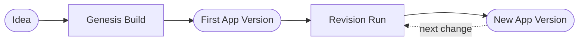

# Genesis Builds and Revision Runs

Every Mozaiks app begins with a **Genesis Build**, which transforms the
builder's intent into the app's first canonical, validated artifact lineage.
Every subsequent change happens through a **Revision Run**, where Mozaiks
understands the current app, chooses the smallest safe path for the requested
change, stages and validates the result, and lets the builder review it before
it becomes the new app state.

Together they form one continuous lifecycle. You describe an app once, and from
then on you evolve it — you never rebuild it from scratch just because you want
it to change.

## The Genesis Build

A Genesis Build is the first full creation of your app. It starts from a
plain-language description — "a booking site for my studio", "an internal tool
to track supplier orders" — and ends with a complete, working app you can
review in Studio.

During a Genesis Build, Mozaiks:

1. **Understands the idea.** It captures what the app is for, who will use it,
   and what makes it valuable, asking questions where your intent is ambiguous.
2. **Designs the experience.** It shapes the look and feel, the pages users
   will see, and how the frontend, backend, and data fit together.
3. **Plans capabilities and workflows.** It decides which deterministic
   capabilities the app needs (records, actions, business rules) and which
   parts should be AI-driven workflows.
4. **Generates the application.** It produces the full app bundle — modules,
   pages, configuration, and the data contract — as staged output, not as live
   code.
5. **Validates the result.** Generated artifacts are checked against the
   contracts Mozaiks apps are built on before anything is presented to you.
6. **Presents it for review.** You inspect the result in Studio and promote it
   when you are satisfied.

When you promote it, the Genesis Build's output becomes the **first
authoritative version of your app**: the canonical state that every future
change is measured against, and the start of your app's revision history.

If you want to see the individual build workflows behind these stages, they are
described in [The Build Sequence](../concepts.md#the-build-sequence).

## Revision Runs

Once your app exists, you never start over. Every change — from fixing a label
to rethinking the whole product — is a **Revision Run**.

A Revision Run always follows the same shape:

1. Mozaiks loads what it knows about your app — its current artifacts, design
   intent, and history — rather than guessing from the request alone.
2. It classifies how big the change really is.
3. It routes the request down the smallest safe path that can deliver it.
4. It stages and validates the result, exactly like a Genesis Build does.
5. You review the change before it becomes the new app state.

### How big is the change?

Mozaiks distinguishes four sizes of change:

| You ask for... | Mozaiks treats it as... | What happens |
| --- | --- | --- |
| A small, localized fix | a **patch** | A targeted edit to just the affected files. Nothing else is touched. |
| A visual or structural update | a **design** change | The relevant pages or layout surfaces are regenerated while the backend stays intact. |
| A new capability in the same product | a **feature** | Mozaiks revisits the planning and generation stages of the Genesis Build with your existing app as context. |
| A fundamental rethink | a **core** change | Mozaiks returns to the concept stage — the beginning of the Genesis Build — carrying forward what still applies. |

The point of classification is economy: a typo fix should never trigger a full
rebuild, and a product pivot should never be squeezed into a code patch. Small
changes are handled as targeted patches; broader changes re-enter the
appropriate part of the Genesis Build — and only that part.

### Your app is always safe

A Revision Run never edits your live app in place:

- **The existing app is preserved.** The current version keeps running and
  remains untouched while changes are prepared.
- **Changes are staged.** New output lands beside your app, not inside it.
- **Changes are validated.** Staged results are checked against the same
  contracts that validated the Genesis Build.
- **You decide.** A change only becomes the new app state after you review and
  accept it.
- **History is kept.** Each accepted change becomes a new revision in your
  app's lineage, so you can always see how the app evolved.

## Examples

**Genesis Builds:**

- "Build a client portal where my customers can see project status and
  invoices." → Mozaiks interviews you about clients and projects, designs the
  portal, generates the modules, pages, and data contract, and presents the
  first version for review.
- "I need an internal app to log equipment inspections with photo uploads and
  weekly summaries." → Mozaiks plans an inspections capability, an AI workflow
  for the summaries, generates the app, and stages it for promotion.

**Revision Runs:**

- "The dashboard title says 'Ivoices' — fix the typo." → classified as a
  patch; one file is edited, validated, and staged for your approval.
- "Make the booking page feel more premium — dark theme, bigger imagery." →
  classified as a design change; the affected pages are regenerated, the
  backend is untouched.
- "Add the ability for customers to leave reviews." → classified as a feature;
  Mozaiks re-plans capabilities with your current app as context and generates
  the new module and pages alongside what already exists.
- "Actually, this shouldn't be customer-facing at all — it should be an
  investor reporting tool." → classified as a core change; Mozaiks returns to
  the concept stage, keeping the history of where the app came from.

## One lifecycle, not many rebuilds

The practical takeaway: treat your app as a living product. Ask for the change
you actually want, at whatever size it is, and Mozaiks will scale the work to
match. The Genesis Build happens once; everything after it is a Revision Run
within the same continuously evolving app lineage.

## Going deeper

For technical readers who want the machinery behind these concepts:

Revision Run is the product-facing term. The architecture uses `refinement`
for the internal engine, routing policy, workers, and contracts that execute a
Revision Run.

- [Refinement](../guides/platform-intelligence/03-refinement.md) — the builder-facing
  guide to change classes and opting an app into refinement
- [Refinement Engine](../architecture/workflows/refinement-engine.md) — how
  post-generation changes are classified, routed, and executed
- [Refinement Harness Architecture](../architecture/workflows/refinement-harness-architecture.md) —
  the checkpoint and routing layer above workflow execution
- [End-to-End App Editing Loop](../architecture/workflows/e2e-app-editing-loop.md) —
  the full edit loop from request to accepted revision
- [Generated App Lifecycle](../architecture/app/generated-app-lifecycle-model.md) —
  the persistent product states an app moves through
