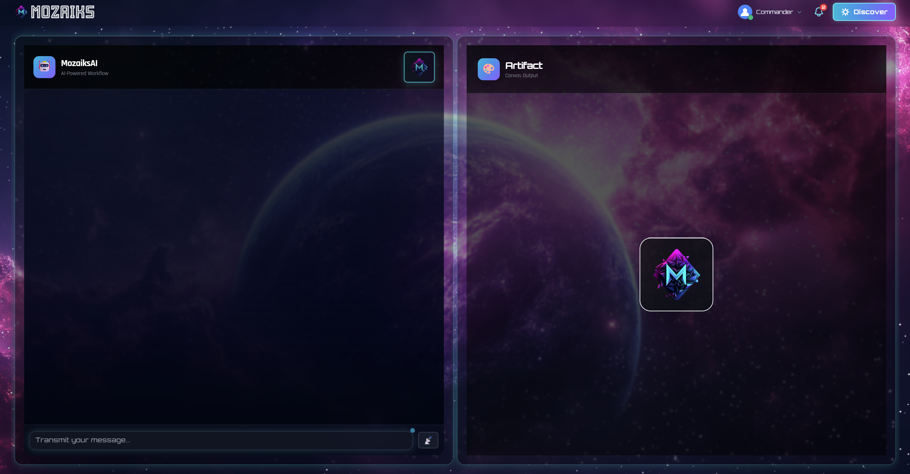
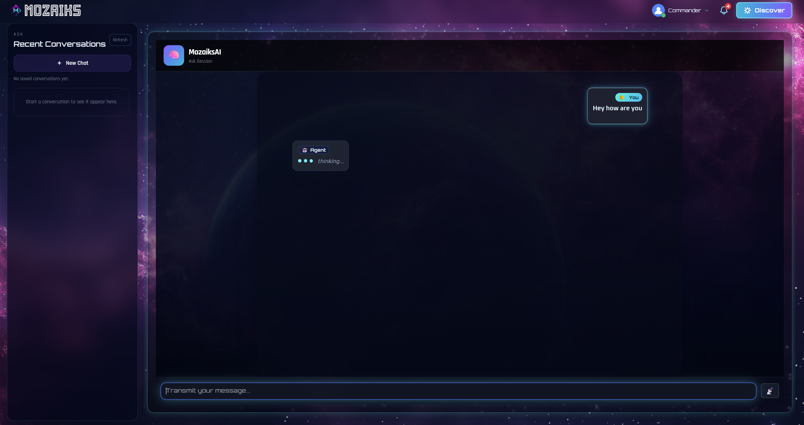
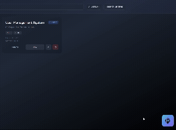

# Mozaiks

  

> **Note**: This is the unified Mozaiks stack. BlocUnited offers a managed platform with app generation tools at [mozaiks.ai](https://mozaiks.ai), but you're welcome to self-host and build everything yourself.

!!! tip "New to Development?"
    **Zero coding experience required!** Copy our [AI Setup Prompt](setup-prompt.md) into any AI coding agent (like [Claude Code](https://claude.ai/download), Cursor, or Copilot) and let AI guide you through the entire setup — from installing prerequisites to running your first app.

---

## 🎯 What is MozaiksAI?

**MozaiksAI Runtime** is a production-ready orchestration engine that transforms AG2 (Microsoft Autogen) into an app-grade platform with:

- ✅ **Event-Driven Architecture** → Every action flows through unified event pipeline
- ✅ **Real-Time WebSocket Transport** → Live streaming to React frontends
- ✅ **Persistent State Management** → Resume conversations exactly where they left off
- ✅ **Multi-Tenant Isolation** → app-scoped data and execution contexts
- ✅ **Dynamic UI Integration** → Agents can invoke React components during workflows
- ✅ **Declarative Workflows** → JSON manifests, no code changes needed
- ✅ **Comprehensive Observability** → Built-in metrics, logging, and token tracking

**MozaiksAI = AG2 + Production Infrastructure + Event-Driven Core**

---

## 🎨 See It In Action

### 🔀 Dual-Mode Interface

| Workflow Mode | Ask Mode |
|:---:|:---:|
|  |  |
| *Chat + Artifact split view* | *Full chat with history sidebar* |

### 💬 Embeddable Floating Widget

*Drop a floating assistant anywhere in your app — click the button to expand/collapse the chat interface*

---

## Next Steps

-   :material-robot: **AI-Assisted Setup**

    ---

    New to coding? Let AI set everything up for you.

    [:octicons-arrow-right-24: AI Setup Prompt](setup-prompt.md)

-   :fontawesome-solid-rocket: **Manual Setup**

    ---

    Clone, configure, and run the full stack yourself.

    [:octicons-arrow-right-24: Getting Started](getting-started.md)

-   :fontawesome-solid-sitemap: **Add a Workflow**

    ---

    Build your own AG2 workflow and wire it to the frontend.

    [:octicons-arrow-right-24: Adding a Workflow](guides/adding-a-workflow.md)

-   :fontawesome-solid-palette: **Brand Your App**

    ---

    Colors, fonts, logo, and nav from JSON files — no code changes.

    [:octicons-arrow-right-24: Customize Frontend](guides/customizing-frontend/01-overview.md)

