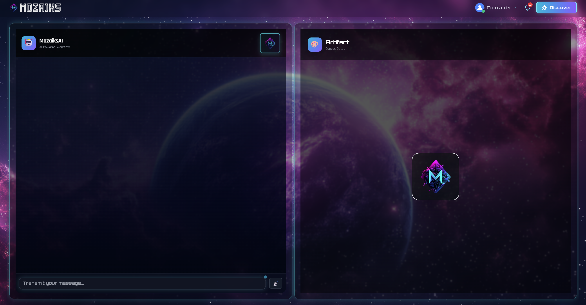
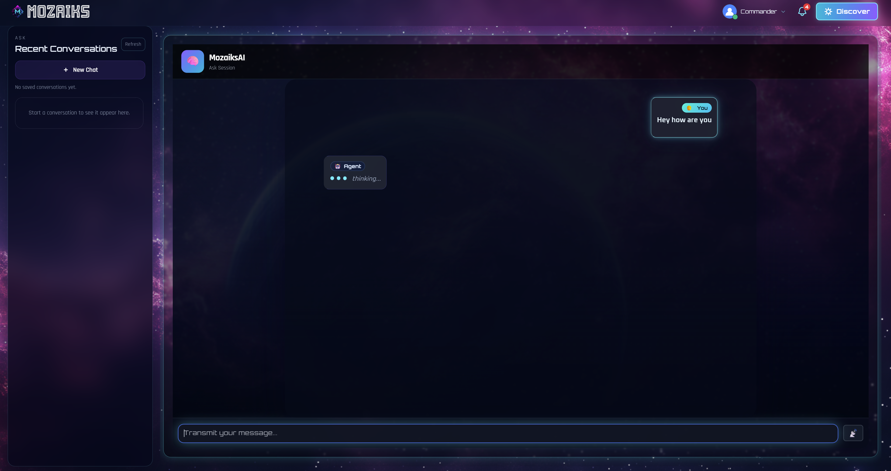

# Mozaiks

> **Note**: This is the unified Mozaiks stack. BlocUnited offers a managed platform with app generation tools at [mozaiks.ai](https://mozaiks.ai), but you're welcome to self-host and build everything yourself.

> **Zero-Code Setup**: New to development? No problem! Copy the [AI Setup Prompt](setup-prompt.md) into your AI coding agent (Claude Code, Cursor, Copilot, etc.) and let AI guide you through the entire setup.

---

## 🎯 What is mozaiksai?

**mozaiksai Runtime** is a production-ready orchestration engine that transforms AG2 (Microsoft Autogen) into an app-grade platform with:

- ✅ **Event-Driven Architecture** -> Every action flows through unified event pipeline
- ✅ **Real-Time WebSocket Transport** -> Live streaming to React frontends
- ✅ **Persistent State Management** -> Resume conversations exactly where they left off
- ✅ **Multi-Tenant Isolation** -> app-scoped data and execution contexts
- ✅ **Dynamic UI Integration** -> Agents can invoke React components during workflows
- ✅ **Declarative Workflows** -> JSON manifests, no code changes needed
- ✅ **Comprehensive Observability** -> Built-in metrics, logging, and token tracking

**mozaiksai = AG2 + Production Infrastructure + Event-Driven Core**

---

## 🎨 See It In Action

### 💬 Embeddable Floating Widget

<video controls muted loop playsinline width="700">
  <source src="assets/widgetAction_compressed.mp4" type="video/mp4">
</video>

*Drop a floating assistant anywhere in your app - click the button to expand/collapse the chat interface*

---

### 🔀 Dual-Mode Interface

| Workflow Mode | Ask Mode |
|:---:|:---:|
|  |  |
| *Chat + Artifact split view* | *Full chat with history sidebar* |

---

## Start Here

Choose the path that matches what you need to do.

-   :material-rocket-launch: **Run Mozaiks Locally**

    ---

    Clone the repo, configure the environment, and boot the stack.

    [:octicons-arrow-right-24: Getting Started](getting-started.md)

-   :material-robot-outline: **Use an AI Coding Agent**

    ---

    Hand setup or feature work to Claude Code, Cursor, or Copilot with the provided prompt packs.

    [:octicons-arrow-right-24: Prompt Packs](instruction-prompts/prompt-packs.md)

-   :material-sitemap: **Build a Workflow**

    ---

    Add agents, tools, handoffs, UI tools, and testing to a new workflow under `platform/workflows/`.

    [:octicons-arrow-right-24: Workflow Guide](guides/adding-workflows/01-overview.md)

-   :material-view-dashboard-outline: **Configure the App Shell**

    ---

    Customize branding, layout chrome, auth, and shell behavior without editing core runtime code.

    [:octicons-arrow-right-24: App Shell & Branding](guides/custom-brand-integration/01-overview.md)

-   :material-book-open-page-variant: **Understand the Architecture**

    ---

    Learn how the runtime, event bus, workflows, modules, and app bundle fit together.

    [:octicons-arrow-right-24: Architecture Overview](architecture/index.md)

-   :material-file-document-multiple-outline: **Open Advanced References**

    ---

    Read deep dives, runtime notes, and lower-level implementation guidance.

    [:octicons-arrow-right-24: Reference](reference/index.md)

